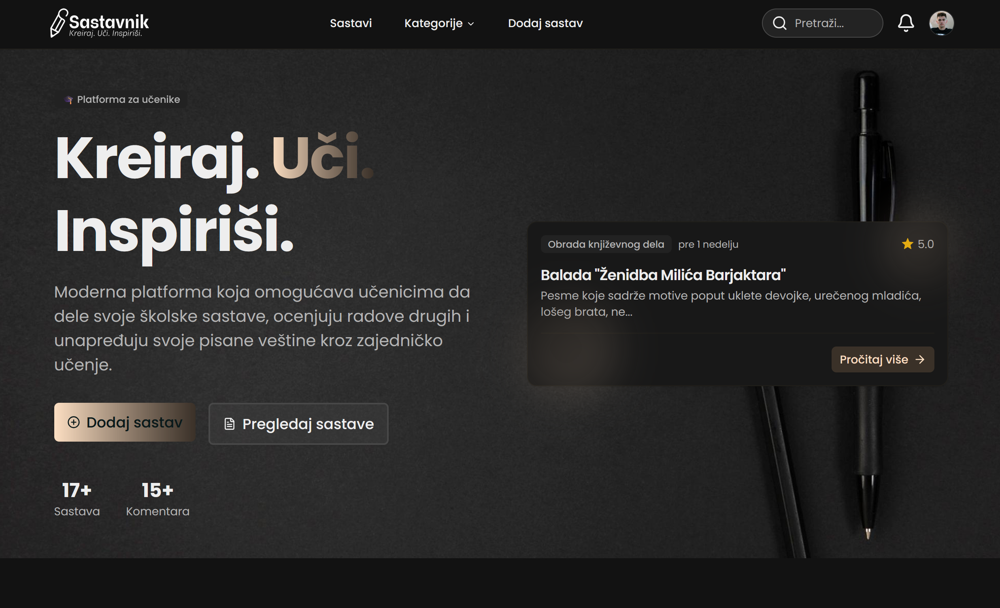
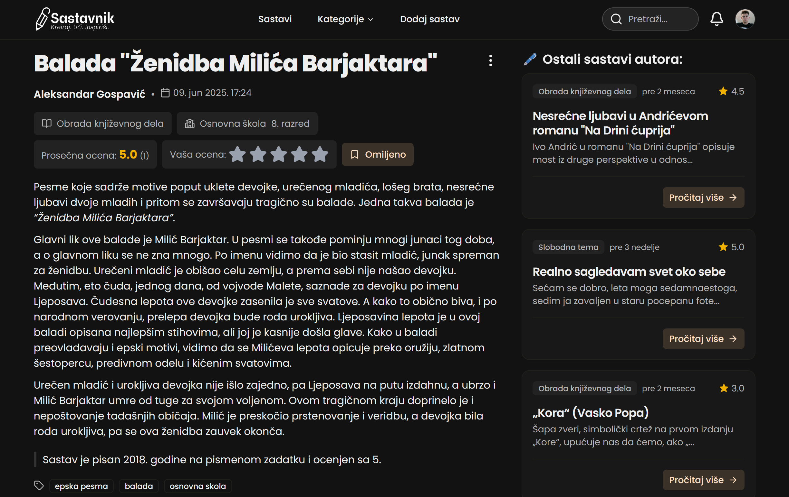
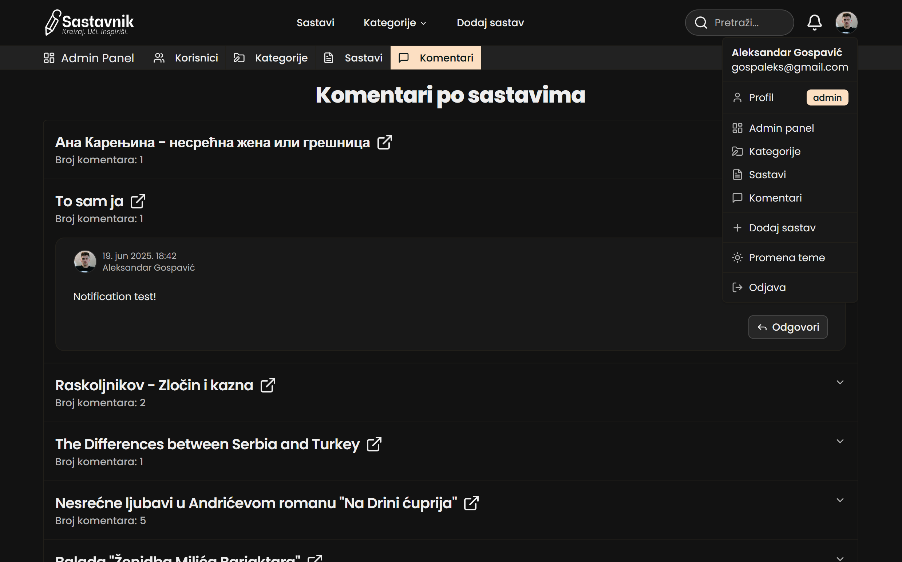
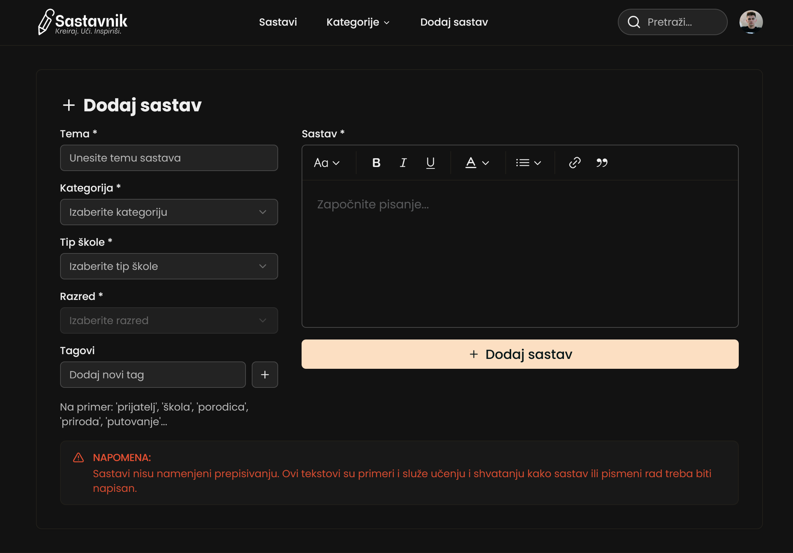
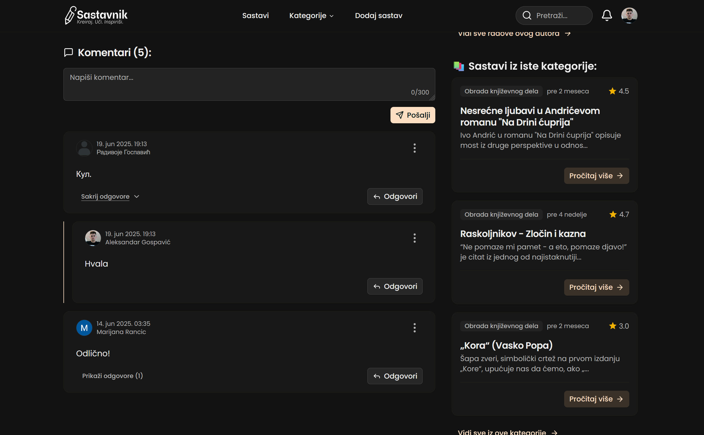

  

  
Sastavi za osnovnu i srednju školu. Inspirši se, nauči i napiši svoj najbolji sastav do sada!

<a href="#-o-projektu">O projektu</a> •
<a href="#-demo">Demo</a> •
<a href="#-tech-stack">Tehnologije</a>

---

## 🚀 Dostupno na

[sastavnik.gospaleks.rs](https://sastavnik.gospaleks.rs)

---

## 📝 O projektu

**Sastavnik** je web platforma za učenike osnovnih i srednjih škola, gde mogu:

- Objavljivati sopstvene sastave
- Pregledati, oceniti i komentarisati tuđe sastave
- Filtrirati sastave po kategoriji, tipu škole i razredu
- Dodavati omiljene sastave i inspirisati se za pismene zadatke

Platforma je nastala sa ciljem da podrži učenike u razvijanju veštine pisanja kroz međusobnu razmenu znanja.

Pored korisničkog dela, platforma poseduje i **admin panel** sa punim CRUD operacijama, što omogućava administraciju sastava, korisnika, kategorija i komentara, radi bolje kontrole i moderacije sadržaja.

---

## 📸 Screenshot

  
  
  
  
  

---

## 🛠️ Tech Stack

- [Next.js](https://nextjs.org/)
- [React](https://reactjs.org/)
- [TypeScript](https://www.typescriptlang.org/)
- [Tailwind CSS](https://tailwindcss.com/)
- [shadcn/ui](https://ui.shadcn.com/)

**Autentifikacija:**

- [Kinde](https://kinde.com/)

**Baza podataka:**

- [PostgreSQL](https://www.postgresql.org/)
